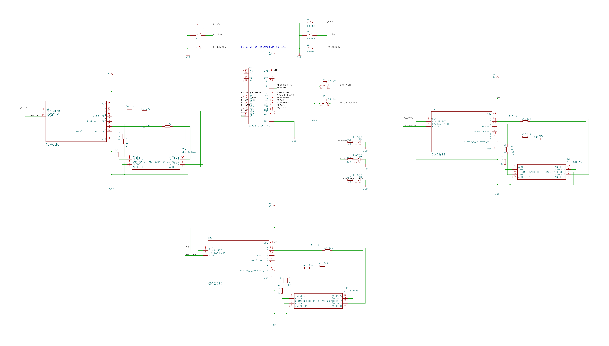
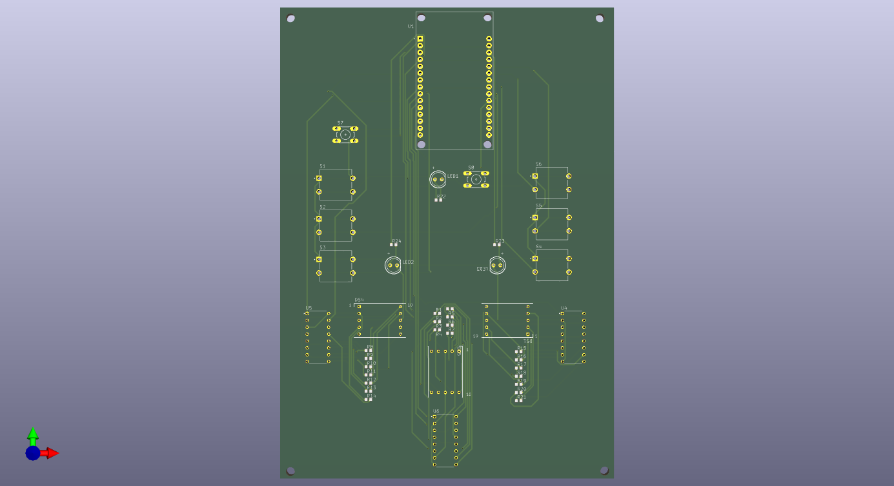
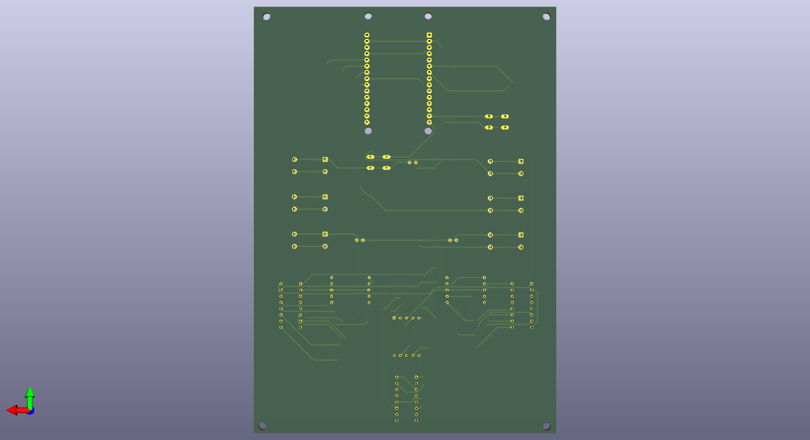

# ESP32 Rock-Paper-Scissors with AI Mode ✊🖐✌️

A hardware rock-paper-scissors game built with an ESP32 microcontroller, featuring physical buttons, LED scorekeeping, a hardware 7-segment timer (CD4026), and a Player vs. Computer (AI) mode.

## Features
* **Two Player Mode:** Play against a friend using external external push buttons.
* **AI Mode:** Play against the ESP32!
* **Hardware Timer:** A 10-second countdown logic utilizing the CD4026 decade counter.
* **Score Tracking:** Tracks score up to 5 wins and announces the match winner with an LED sequence.

## Schematic / PCB view

## Hardware Requirements
* 1x ESP32 Development Board
* 2x CD4026 Decade Counters (for the timer display and score tracking)
* 8x Push buttons (3 per player + Start/Reset + AI Mode)
* 3x LEDs (Player 1 Win, Player 2 Win, AI Mode indicator)
* Resistors for LEDs (the code utilizes ESP32's internal pull-up resistors for the buttons)

## ESP32 Pinout Mapping

**System & Timer:**
* Timer Clock: `GPIO 21`
* Timer Reset: `GPIO 19`
* Start/Reset Button: `GPIO 22`
* AI Mode Button: `GPIO 23`
* AI Mode LED: `GPIO 2`

**Player 1:**
* Rock: `GPIO 32` | Paper: `GPIO 33` | Scissors: `GPIO 25`
* Score Clock: `GPIO 17` | Score Reset: `GPIO 16`
* Win LED: `GPIO 12`

**Player 2:**
* Rock: `GPIO 26` | Paper: `GPIO 14` | Scissors: `GPIO 27`
* Score Clock: `GPIO 18` | Score Reset: `GPIO 5`
* Win LED: `GPIO 13`

## How to play
1. Power up the ESP32 board.
2. Press **START** to begin a 10-second round.
3. Players select their moves before the timer runs out.
4. The winner of the round gets a point. First to 5 points wins the match!
